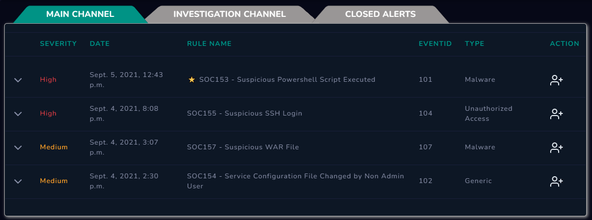
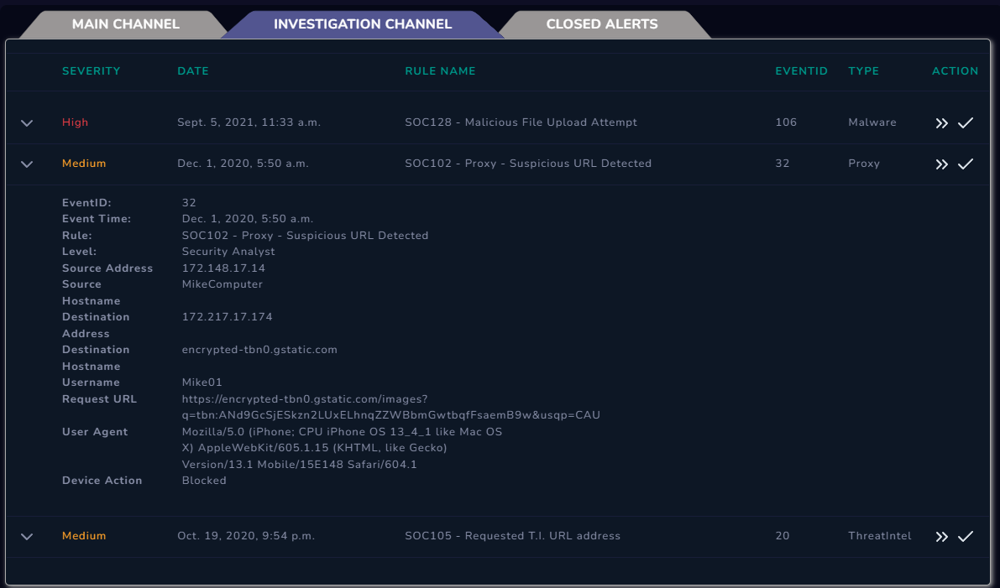

# 🛡️ 1.4 SIEM and Analyst Relationship

This lesson explores how a SOC Analyst interacts with the SIEM (Security Information and Event Management) system to monitor, investigate, and manage security incidents.

### **SIEM Workflow for Analysts**
An analyst's job starts when the SIEM triggers an alert. The workflow follows these key steps:
1. **Monitoring:** Reviewing new alerts in the **Main Channel**.
2. **Taking Ownership:** Selecting an alert to move it to the **Investigation Channel**, signaling to the team that the case is being handled.
3. **Artifact Gathering:** Collecting details like Hostnames, IP addresses, and User Agents.
4. **Triaging:** Deciding if the alert is a **True Positive** (real threat) or a **False Positive** (false alarm).

---

### **Practical Analysis: Monitoring vs. Investigation**

Based on the LetsDefend lab, I analyzed how the SIEM organizes alerts:

#### **1. Main Channel (Monitoring)**
This is the shared dashboard where all incoming alerts are categorized by Severity and Rule Name.
* **Key Alerts Observed:**
    * **SOC153:** Suspicious Powershell Script Executed (High Severity)
    * **SOC155:** Suspicious SSH Login (High Severity)

### **Practical Evidence: SIEM Interface**

#### **1. Main Channel Monitoring**
The shared dashboard where the SOC team monitors all incoming security events.

#### **2. Investigation Channel (Detailed Artifacts)**
Detailed analysis of EventID 32 showing Source IP (172.148.17.14) and Device Action (Blocked).

---
*Status: Gained hands-on experience in navigating SIEM channels and extracting technical artifacts for investigation.*
