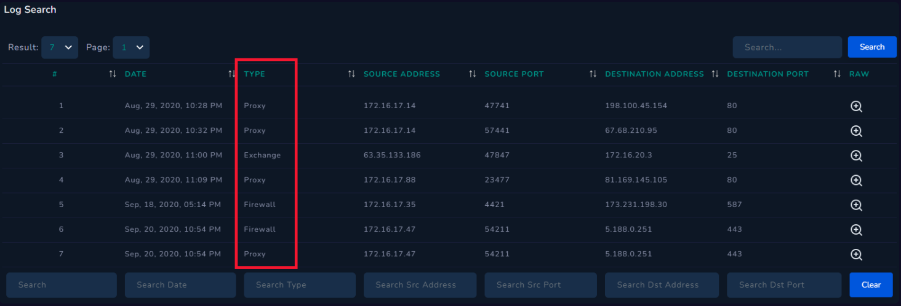

# 🛡️ 1.5 Log Management

In this lesson, I learned about the importance of Log Management systems and how they serve as a centralized hub for investigating security incidents.

### **What is Log Management?**
Log Management is a solution that provides access to all logs in an environment (Web logs, OS logs, Firewall, Proxy, EDR, etc.) in one centralized location. 
* **Efficiency:** Instead of checking individual devices, an analyst can run a single query to see data from multiple sources.
* **Accuracy:** It reduces the margin for error by providing a holistic view of the network activity.

---

### **The Purpose of Log Management in SOC**
SOC Analysts rely on Log Management to determine if there is any communication with a particular address and to view the details of that communication.

1. **Identifying Command & Control (C2) Communication:** If malware is found to be communicating with a suspicious domain (e.g., `letsdefend.io`), an analyst can search the logs to see if any other devices in the company have attempted to connect to that same address.
   
2. **Post-Incident Investigation:**
   If a SIEM alert flags one device (e.g., `LetsDefendHost`) for leaking data to a suspicious IP (`122.194.229.59`), the analyst must use Log Management to check if **other** undetected devices are also communicating with that IP.

---

### **Practical Example: Searching Logs**
In the LetsDefend "Log Management" page, logs are categorized by **Type** such as:
* **Proxy**
* **Exchange (Email)**
* **Firewall**

By using the search bar, I can quickly filter through millions of logs to find specific IP addresses, hostnames, or URLs involved in an incident.

### **Practical Evidence: Log Management Search**
The image below shows the centralized log interface where I can perform queries across different log types to trace suspicious activities.

---
*Status: Successfully learned how to perform centralized log searches to uncover hidden threats and identify compromised devices.*
